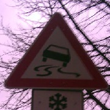

#**Traffic Sign Recognition** 

---

**Build a Traffic Sign Recognition Project**

The goals / steps of this project are the following:
* Load the data set (see below for links to the project data set)
* Explore, summarize and visualize the data set
* Design, train and test a model architecture
* Use the model to make predictions on new images
* Analyze the softmax probabilities of the new images
* Summarize the results with a written report

[//]: # (Image References)

[image1]: ./examples/visual.png "Visualization"
[image2]: ./examples/grayscale.png "Grayscaling"
[image3]: ./examples/equalize.png "Equalization"
[image4]: ./new_images/New1.png "Traffic Sign 1"
[image5]: ./new_images/New2.png "Traffic Sign 2"
[image6]: ./new_images/New3.png "Traffic Sign 3"
[image7]: ./new_images/New4.png "Traffic Sign 4"
[image8]: ./new_images/New5.png "Traffic Sign 5"
[image9]: ./new_images/New6.png "Traffic Sign 6"
[image10]: ./new_images/New7.png "Traffic Sign 7"
[image11]: ./new_images/New8.png "Traffic Sign 8"

## Rubric Points
###Here I will consider the [rubric points](https://review.udacity.com/#!/rubrics/481/view) individually and describe how I addressed each point in my implementation.  

---
###Writeup / README

####1. Provide a Writeup / README that includes all the rubric points and how you addressed each one. You can submit your writeup as markdown or pdf. You can use this template as a guide for writing the report. The submission includes the project code.

You're reading it! and here is a link to my [project code](https://github.com/chunqiu5ba/CarND-Traffic-Sign-Classifier-Project/blob/master/Traffic_Sign_Classifier.ipynb)

###Data Set Summary & Exploration

####1. Provide a basic summary of the data set. In the code, the analysis should be done using python, numpy and/or pandas methods rather than hardcoding results manually.

I used the numpy library to calculate summary statistics of the traffic
signs data set:

* The size of training set is 34799
* The size of the validation set is 4410
* The size of test set is 12630
* The shape of a traffic sign image is (34799, 32, 32, 3)
* The number of unique classes/labels in the data set is 43

####2. Include an exploratory visualization of the dataset.

Here is an exploratory visualization of the data set. It is a bar chart showing traffic sign number counts in each class, three datasets

![alt text][image1]

More details are in the notebook/html file.

###Design and Test a Model Architecture

####1. Describe how you preprocessed the image data. What techniques were chosen and why did you choose these techniques? Consider including images showing the output of each preprocessing technique. Pre-processing refers to techniques such as converting to grayscale, normalization, etc. (OPTIONAL: As described in the "Stand Out Suggestions" part of the rubric, if you generated additional data for training, describe why you decided to generate additional data, how you generated the data, and provide example images of the additional data. Then describe the characteristics of the augmented training set like number of images in the set, number of images for each class, etc.)

As a first step, I decided to convert the images to grayscale because the traffic sign is identified by shape, color is not a factor in the desicion rule. It will simplify the data and reduce the training time.

Here is an example of a traffic sign image before and after grayscaling.

![alt text][image2]

Next, noticed some traffic signs are barely to be identified, I processed the images with Histograms Equalization. This will minimize the huge differences in the light conditoin from source images. It helps increasing the prediction accuracy. 

![alt text][image3]

As a last step, I normalized the image data because this will imoprove the quality of the data we feed to the neural network. It's an important preparation step for SGD optimizer.

####2. Describe what your final model architecture looks like including model type, layers, layer sizes, connectivity, etc.) Consider including a diagram and/or table describing the final model.

My final model consisted of the following layers:

| Layer         		|     Description	        					| 
|:---------------------:|:---------------------------------------------:| 
| Input         		| 32x32x1 gray image   							| 
| Convolution 5x5     	| 1x1 stride,valid padding, outputs 28x28x12 	|
| RELU					|												|
| Max pooling	      	| 2x2 stride,  outputs 14x14x12 				|
| Convolution 5x5   	| 1x1 stride,valid padding, outputs 10x10x32	|
| RELU					|												|
| Max pooling	      	| 2x2 stride,  outputs 5x5x32 					|
| Flatten       		| outputs 800 									|
| Dropout				| Keep prob 0.5 								|
| Fully connected		| outputs 240  									|
| Fully connected		| outputs 84    								|
| Fully connected		| outputs 43   									|
|						|												|
|						|												|

####3. Describe how you trained your model. The discussion can include the type of optimizer, the batch size, number of epochs and any hyperparameters such as learning rate.

To train the model, I used an Lenet 5 Architecture, doubled filters on convolution layers. Optimizer is Adaptive Moment Estimation (Adam).
- batch size: 128
- epochs: 15
- learning rate: 0.001
- mu: 0
- sigma: 0.1
- dropout keep probability: 0.5

####4. Describe the approach taken for finding a solution and getting the validation set accuracy to be at least 0.93. Include in the discussion the results on the training, validation and test sets and where in the code these were calculated. Your approach may have been an iterative process, in which case, outline the steps you took to get to the final solution and why you chose those steps. Perhaps your solution involved an already well known implementation or architecture. In this case, discuss why you think the architecture is suitable for the current problem.

My final model results were:
* validation set accuracy of 0.96 
* test set accuracy of 0.94

If an iterative approach was chosen:
* What was the first architecture that was tried and why was it chosen?
* What were some problems with the initial architecture?
* How was the architecture adjusted and why was it adjusted? Typical adjustments could include choosing a different model architecture, adding or taking away layers (pooling, dropout, convolution, etc), using an activation function or changing the activation function. One common justification for adjusting an architecture would be due to overfitting or underfitting. A high accuracy on the training set but low accuracy on the validation set indicates over fitting; a low accuracy on both sets indicates under fitting.
* Which parameters were tuned? How were they adjusted and why?
* What are some of the important design choices and why were they chosen? For example, why might a convolution layer work well with this problem? How might a dropout layer help with creating a successful model?

I started with Lenet-5 architecture, it worked pretty good with about 85%. I have tested with adjusting epochs number, learning rate, and number of fully connected layers, those did't bring up prediction rates. 

Finally I decided double the filters on convolution layers, increasing layer output from 28x28x6 to 28x28x12. This will double the data feeding into the modle. To avoid overfeeding problem, I also added a dropout layer before fully connected layer. After this change, prediction rate increased to aroud 96%. I also kept epochs as 15 as it would give better rate compared with 10 epochs.

If a well known architecture was chosen:
* What architecture was chosen?
* Why did you believe it would be relevant to the traffic sign application?
* How does the final model's accuracy on the training, validation and test set provide evidence that the model is working well?
 

###Test a Model on New Images

####1. Choose five German traffic signs found on the web and provide them in the report. For each image, discuss what quality or qualities might be difficult to classify.

Here are eight German traffic signs that I found on the web:

   
   

The fifth image might be difficult to classify because it's dark and has branches in the backgroud. In real test, the last image "No passing" could not be identified, which is out of my expectation.

####2. Discuss the model's predictions on these new traffic signs and compare the results to predicting on the test set. At a minimum, discuss what the predictions were, the accuracy on these new predictions, and compare the accuracy to the accuracy on the test set (OPTIONAL: Discuss the results in more detail as described in the "Stand Out Suggestions" part of the rubric).

Here are the results of the prediction:

| Image			        |     Prediction	        					| 
|:---------------------:|:---------------------------------------------:| 
| Stop Sign      		| Stop sign   									| 
| Right of Way 			| Right of Way									|
| General Causion		| General Causion       						|
| Priority Road 		| Priority Road					 				|
| Slippery Road			| Slippery Road      							|
| 30 km/h   			| 30 km/h   									|
| End of all Speed		| End of all Speed  			 				|
| No Passing    		| No Entry          							|

The model was able to correctly guess 7 of the 8 traffic signs, which gives an accuracy of 0.875. This compares lower to the accuracy on the test set of 0.94. As I used only 8 test images, we can say the test result on new images and test set are close enough.

####3. Describe how certain the model is when predicting on each of the five new images by looking at the softmax probabilities for each prediction. Provide the top 5 softmax probabilities for each image along with the sign type of each probability. (OPTIONAL: as described in the "Stand Out Suggestions" part of the rubric, visualizations can also be provided such as bar charts)

The code for making predictions on my final model is located in the 18th cell of the Ipython notebook.

For the first image, the model is relatively sure that this is a stop sign (probability of 0.99), and the image does contain a stop sign. The top five soft max probabilities were

| Probability         	|     Prediction	        					| 
|:---------------------:|:---------------------------------------------:| 
| 1.00         			| Stop sign   									| 
| .00     				| Yield             							|
| .00					| No entry   									|
| .00	      			| Keep right   					 				|
| .00				    | 30 km/h           							|

For the second image, the model is sure that this is a Right-of-way at the next intersection sign (probability of 0.99). The top five soft max probabilities were 

| Probability         	|     Prediction	        					| 
|:---------------------:|:---------------------------------------------:| 
| .99         			| Right-of-way at the next interseciton			| 
| .00     				| Beware of ice/snow							|
| .00					| Slippery road									|
| .00	      			| Road narrows on the right		 				|
| .00				    | Double curve      							|

For the third image, the model is sure that this is a General Causion sign (probability of 0.99). The top five soft max probabilities were

| Probability         	|     Prediction	        					| 
|:---------------------:|:---------------------------------------------:| 
| .99         			| General Causion   							| 
| .00     				| Traffic signals								|
| .00					| Pedestrians           						|
| .00	      			| Go straight or left 			 				|
| .00				    | Right-of-way      							|

For the fourth image, the model is sure that this is a Priority road sign (probability of 0.99). The top five soft max probabilities were

| Probability         	|     Prediction	        					| 
|:---------------------:|:---------------------------------------------:| 
| 1.00         			| Priority Road 								| 
| .00     				| Speed limit 100 km/h							|
| .00					| Roundabout mandatory							|
| .00	      			| Stop      					 				|
| .00  				    | Yield                  						|

For the fifth image, the model is relatively sure that this is a Slippery sign (probability of 0.83). This is a difficult one as the source image has an complex background. A interestiong point is prediction shows "Beware of ice/snow" sign as an possible answer, and the image does contain a snow sign. The top five soft max probabilities were

| Probability         	|     Prediction	        					| 
|:---------------------:|:---------------------------------------------:| 
| .81         			| Slippery road 								| 
| .10     				| Beware of ice/snow        					|
| .03					| Road work                 					|
| .02	      			| Children crossing     		 				|
| .02				    | General cauion     							|

For the sixth image, the model is sure that this is a 30 km/h sign (probability of 0.99). The top five soft max probabilities were

| Probability         	|     Prediction	        					| 
|:---------------------:|:---------------------------------------------:| 
| .99         			| 30 km/h   									| 
| .00     				| 70 km/h										|
| .00					| 60 km/h            							|
| .00	      			| 50 km/h   					 				|
| .00				    | 20 km/h           							|

For the seventh image, the model is sure that this is a End of all speed and passing limits sign (probability of 0.99). The top five soft max probabilities were

| Probability         	|     Prediction	        					| 
|:---------------------:|:---------------------------------------------:| 
| .98         			| End of all Speed and passing limits			| 
| .02     				| End of no passing								|
| .00					| End of speed 80km/h							|
| .00	      			| End of no passing by vehicles over 3.5 metric	|
| .00				    | Priority road      							|

For the last image, the model is relatively sure that this is a Keep Right sign (probability of 0.75), but it is wrong. I can understand the prediction failed to classified this as a No Entry Sign could due to images details lost when resized. The top five soft max probabilities were

| Probability         	|     Prediction	        					| 
|:---------------------:|:---------------------------------------------:| 
| .89         			| No Entry   									| 
| .06     				| Go Stright or right							|
| .02					| Roundabout mandatory 							|
| .01	      			| No passing 					 				|
| .00				    | Priority road     							|

### (Optional) Visualizing the Neural Network (See Step 4 of the Ipython notebook for more details)
####1. Discuss the visual output of your trained network's feature maps. What characteristics did the neural network use to make classifications?

